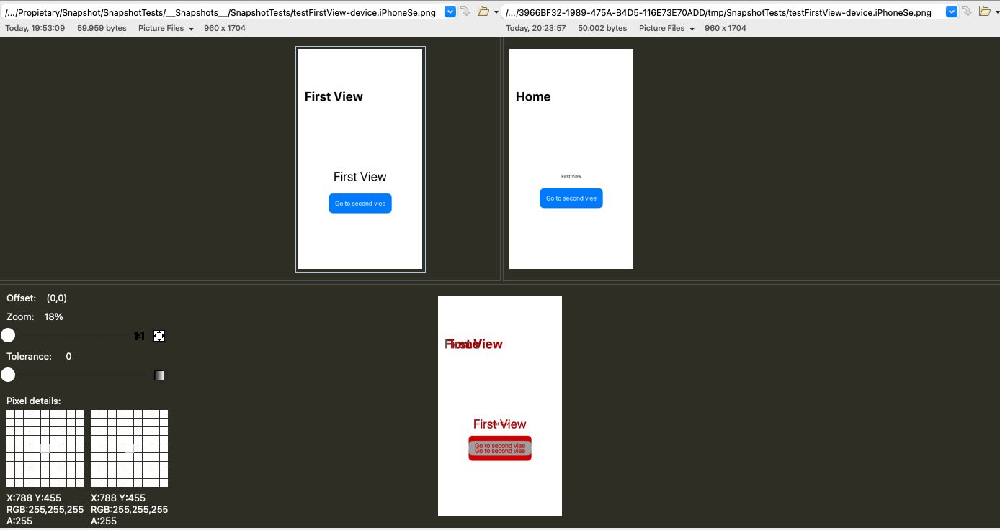

# Snapshot
Sample iOS project that shows a sample on how implementing snapshot testing. This is the basecode for following post [S.O.L.I.D. principles in Swift](https://javios.eu/uncategorized/solid-principles-in-swift/)

## Screenshots - ISP principle in Swift

## Requirements

- **Xcode 15.0 or later**
- **iOS 16.0 or later**
